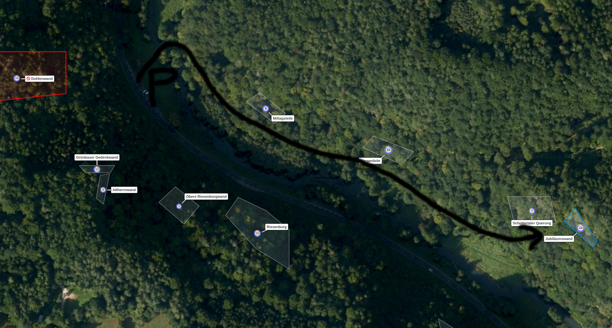

# Sport Climbing in the Franconian Jura

Die-hard campers should not be put off by the [Bärenschlucht campsite website](http://www.baerenschlucht-camping.de/).
Once the daily motorbike noise has died down, the location is idyllic and good climbing rocks are within walking distance.
The camping site Waldmühle is an alternative and Forelle is delicious.

## [Jubiläumswand](https://www.thecrag.com/de/klettern/germany/frankenjura/jubilaumswand)

The Jubiläumswand is a perfect starting wall for the first days on rock in UIAA difficulty 4 and upwards.
Park on the country road near a bridge marked by a small transformation house.
The 5-minute approach to the crag is very entertaining.

- Lurchi 5
- R1a 4
- Naturalis 5
- Manrefd Schuh Gedenkweg / R1 4+

##

## [Treunitzer Wand](https://www.thecrag.com/climbing/germany/frankenjura/treunitzer-wand)

This wall is a little green and not too big. Solid routes.

## [Glatzenstein](https://www.thecrag.com/de/klettern/germany/frankenjura/glatzenstein)

The main wall on the Glatzenstein impresses with wall heights of between 30 and 40 metres.
The difficulty of the routes corresponds at least to the grades given in the topos and
less experienced climbers may be well advised to try out the top rope first by hiking up the right-hand side of the route Sex with Graut.

- Sex mit Graut 5+
- Weißenbacher Backers 6-
- Purtscheller Gedenkweg 6-
- Weißenbacher Weg 6+
