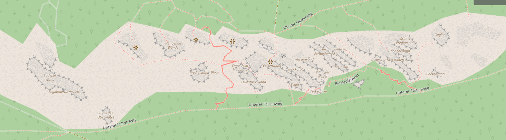

# [Battert](https://www.thecrag.com/de/klettern/germany/schwarzwald/area/251539842)

A-numbers in braces indicate sections in Panico Schwarzwald Band Nord.

## Hohe Wand (A8)

- Handfegerverschneidung (Lead)
- Handfegerverschneidung-Kombination Steinlaus (Lead)

## Falkenwand (A11-1)

- Proloriss (Top rope) [^1]
  - Requires two 120cm slings, four 120cm slings of you want to have redundancy in terms of slings. There is only one fix point in about 240cm dinstance from the edge.

## Predigtstuhl-Vorgipfel (A7)

- The south side is a nice slab playground and installation of top rope is straight forward when approached from the noth-east. (Top rope) [^1]

## Schöne Wand (A6)

- Mixed Schönes Wandel, Luzifers Traum, Birkenplatte (Top rope) [^1]

---

## First time Batter: A beginners guide

1. Predigtstuhl-Vorgipfel (A7) (Top rope)
2. Schöne Wand (A6) (Top rope)
3. Hohe Wand (A8) (Lead)
   - Handfegerverschneidung
   - Steinlaus
4. Fermeda (A16) (Top rope)
   - Graue Wand
   - Hät net solle

[^1]: 2024-08-10
