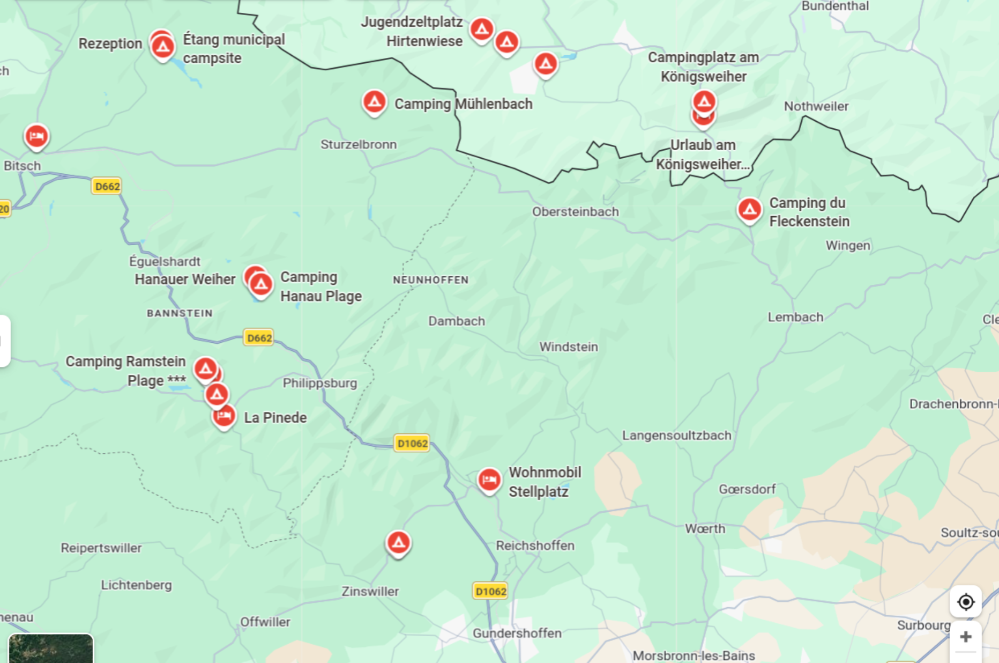

# Campen und Klettern in den Vogesen

## [Vosges du nord](https://www.thecrag.com/climbing/france/alsace-lorraine/area/786455745/maps#48.9941,7.6691,12.0,,auto)

- [Camping Du Fleckenstein](https://www.lembach.fr/camping/?Localisation)
  - geöffnet ca. 29.03.-05.10.
- [Camping am Hanauer Weiher](https://www.philippsbourg.fr/page141-125-reservierung.html)
  - geöffnet ca. 01.04.-
- [Camping Muhlenbach](https://www.camping-muhlenbach.com/willkommen/)
  - geöffnet ca. 01.04.-30.09.
- [Domaine Heidenkopf](https://www.domaine-heidenkopf.fr/de/stellplatze/)
  - Die Domaine empfängt Sie vom 1. April 2025 bis zum 4. Januar 2026?
